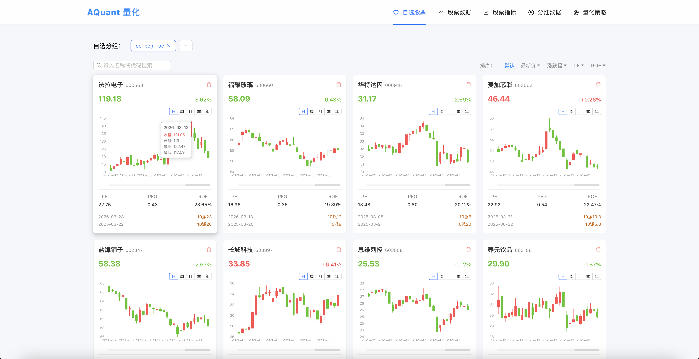
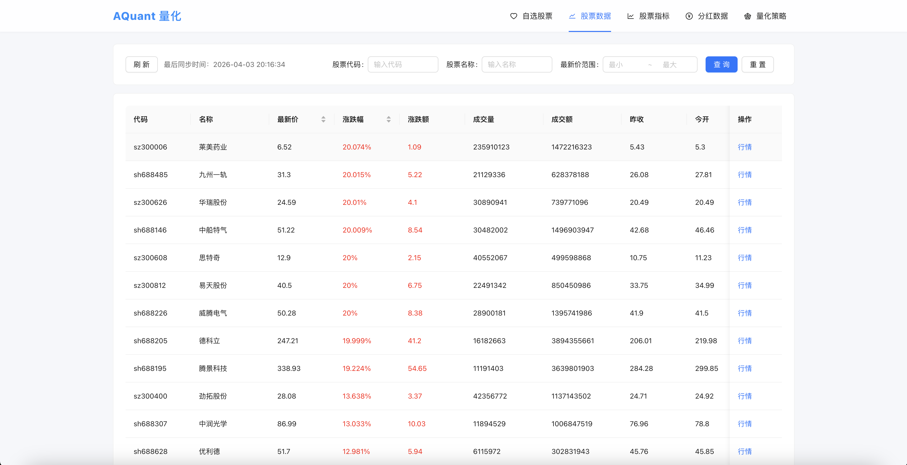
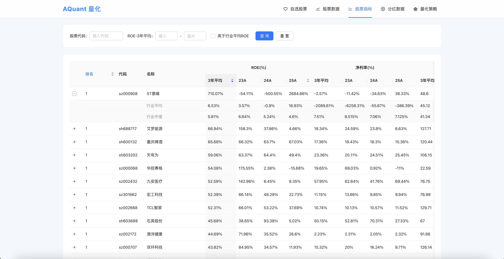
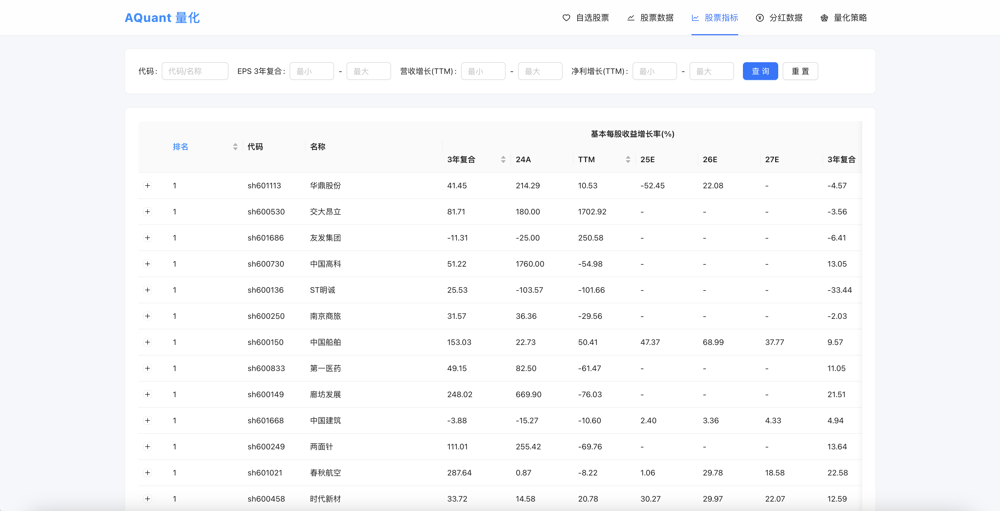
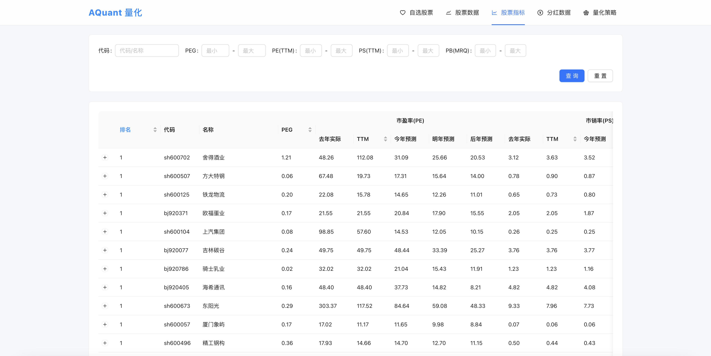
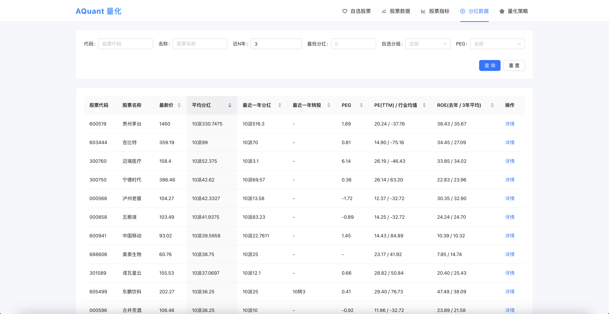
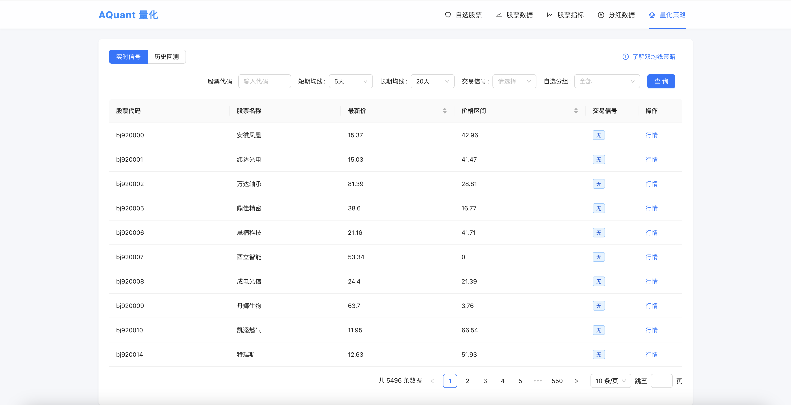

# AQuant - 智能量化交易分析平台

AQuant 是一款基于现代 Web 技术栈开发的量化交易分析平台。它为投资者和开发者提供了一套完整的工具，用于股票数据分析、财务指标可视化、板块轮动监测以及简单的量化策略执行。

## 🚀 核心功能

- **📊 股票行情查询**：支持全市场股票实时行情展示，包含分时/K线图表（周/月/季/年周期切换）。
- **🧪 深度指标分析**：
  - **杜邦分析**：拆解 ROE，多维度评估企业盈利能力。
  - **成长性指标**：跟踪 PEG、营收/利润增长情况。
  - **估值模型**：PE、PB、PS 等关键估值指标的行业对比。
- **📈 板块监测**：实时监控行业/概念板块表现，支持成份股下钻分析及板块历史趋势。
- **💰 分红专项分析**：深度挖掘个股分红历史，计算股息率，辅助高股息红利策略选择。
- **🤖 自动化策略**：
  - **双均线策略(Dual MA)**：内置经典量化模型，自动扫描全市场多空信号。
  - **自选股增强**：支持策略一键筛选自选股组合。
- **❤️ 智能自选管理**：灵活的分组管理，支持快速添加股票（代码智能识别补全），并可跨模块联动筛选。

## 🎬 界面展示
### 自选股票


### 股票数据


### 板块数据


### 股票指标
  
  
  

### 分红数据


### 策略
  

## 🛠️ 技术栈

### 后端 (aquant-backend)
- **核心框架**: Spring Boot 3.x
- **持久层**: Spring Data JPA
- **数据库**: MySQL 8.x
- **文档工具**: Swagger / SpringDoc OpenAPI 3
- **工具库**: Lombok, Apache Commons

### 前端 (aquant-frontend)
- **核心框架**: Vue 3 (Composition API)
- **构建工具**: Vite
- **脚本语言**: TypeScript
- **UI 组件库**: Ant Design Vue 4.x
- **状态管理**: Pinia
- **路由管理**: Vue Router
- **网络请求**: Axios

## 📦 快速开始

### 1. 克隆项目
```bash
git clone <repository-url>
cd AQuant
```

### 2. 后端启动
- 进入 `aquant-backend` 目录。
- 在 `src/main/resources/application.properties` 中配置您的 MySQL 连接信息。
- 执行本地构建并运行：
```bash
mvn clean install
mvn spring-boot:run
```
- 后端服务默认运行在: `http://localhost:8084`
- API 文档访问: `http://localhost:8084/swagger-ui.html`

### 3. 前端启动
- 进入 `aquant-frontend` 目录。
- 安装依赖并启动开发服务器：
```bash
npm install
npm run dev
```
- 前端项目默认地址: `http://localhost:5173`
- *注：Vite 已配置代理，会自动转发 `/api` 请求至 backend。*

## 📂 项目结构

```text
AQuant/
├── aquant-backend/          # Spring Boot 后端源码
│   ├── src/main/java        # Java 核心逻辑
│   └── src/main/resources   # 配置文件与资源
├── aquant-frontend/         # Vue 3 前端源码
│   ├── src/api              # 接口请求模块
│   ├── src/views            # 业务页面
│   ├── src/layout           # 基础布局
│   └── src/router           # 路由配置
└── README.md                # 项目文档
```

## 📝 许可证

本项目采用 [MIT License](LICENSE) 授权。

---
*量化有风险，投资需谨慎。*
