# AQuant - 智能量化交易分析平台

AQuant 是一款基于现代 Web 技术栈开发的量化交易分析平台。它为投资者和开发者提供了一套完整的工具，用于股票/基金数据分析、财务指标可视化、板块轮动监测、自选预警以及量化策略回测。

## 🚀 核心功能

- **📊 股票行情查询**：支持全市场股票实时行情展示，包含分时/K线图表（周/月/季/年周期切换）。
- **🧪 深度指标分析**：
  - **杜邦分析**：拆解 ROE，多维度评估企业盈利能力。
  - **成长性指标**：跟踪 PEG、营收/利润增长情况。
  - **估值模型**：PE、PB、PS 等关键估值指标的行业对比。
- **📈 板块监测**：实时监控行业/概念板块表现，支持成份股下钻分析及板块历史趋势。
- **🧾 基金数据分析**：支持基金列表筛选、净值走势、购买信息、QDII/海外基金历史净值与最新持仓明细展示。
- **💰 分红专项分析**：深度挖掘个股分红历史，计算股息率，辅助高股息红利策略选择。
- **🤖 自动化策略**：
  - **双均线策略(Dual MA)**：内置经典量化模型，自动扫描全市场多空信号。
  - **动量策略(Momentum)**：基于价格走势强度进行筛选，支持自定义回望周期与信号曲线分析。
  - **离线回测快照**：定时计算预设参数组合的历史回测快照，查询时直接读取快照结果，提升列表响应速度。
  - **可靠度分析**：回测结果支持胜率、累计收益、显著性(p)与可靠度筛选。
- **❤️ 智能自选管理**：灵活的分组管理，支持股票排序、跨分组移动、快速添加股票，并可跨模块联动筛选。
- **🔔 智能通知**：支持价格向上/向下突破、双均线信号等规则，定时检查行情并通过邮件通知用户。
- **📝 文章笔记管理**：
  - 支持富文本编辑（Tiptap），可插入图片、代码块、链接等。
  - 文章可见性控制（公开/私密），公开文章可在广场浏览。
  - 支持关键词搜索、无限滚动加载。
- **🔐 用户认证系统**：JWT 令牌认证，支持用户注册、登录、邮箱验证码找回密码。
- **⏰ 定时数据同步**：
  - 自动从 AKShare 拉取股票行情、板块行情、基金基础信息、基金净值、基金持仓、分红与财务指标数据。
  - 支持交易日水位判断，尽量避免重复请求第三方接口，同时保证历史行情连续性。
  - 定时清除退市/异常股票数据，并对分红重复数据进行保守去重。
- **🌐 财经网站导航**：整合常用财经网站入口，快速跳转。

## 🏗️ 系统架构

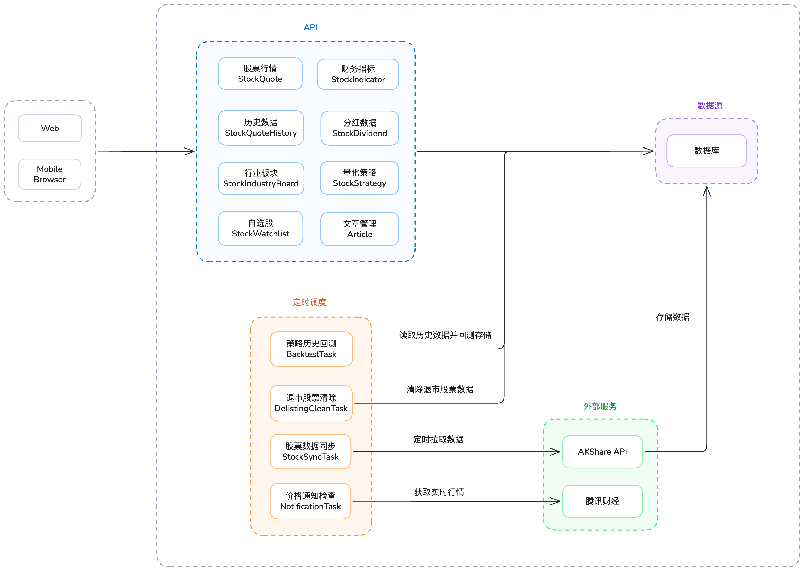

## 🎬 界面展示
### 自选股票
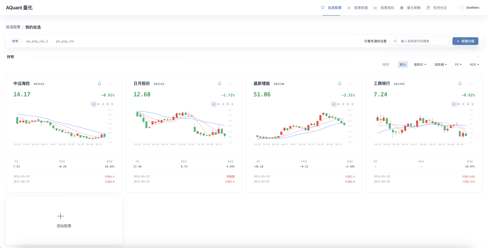
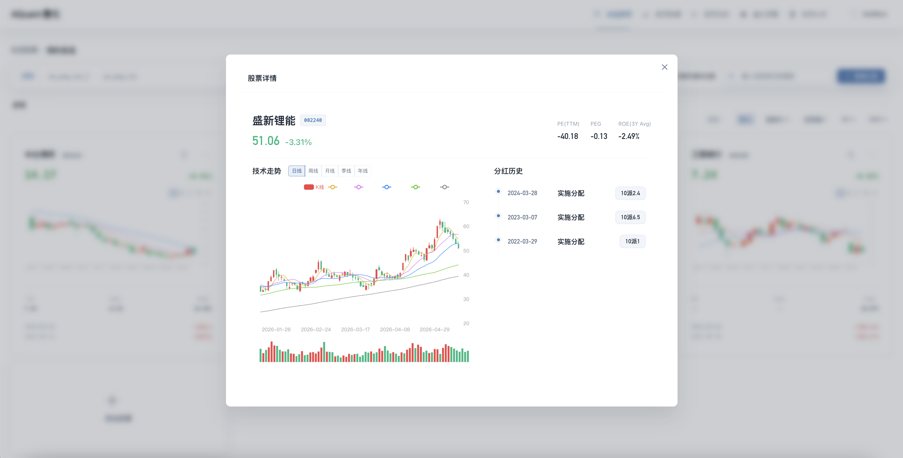
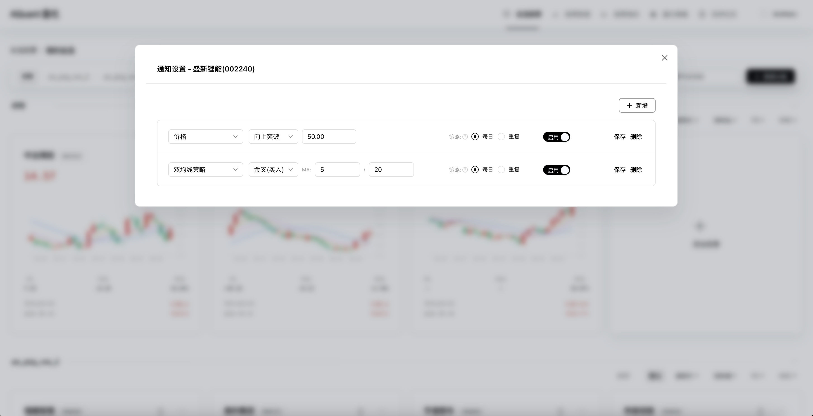

### 股票数据
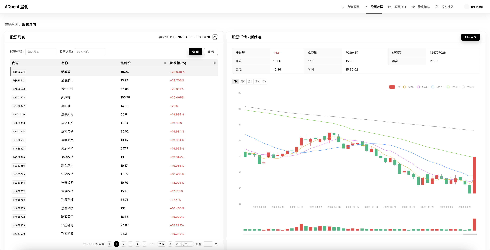
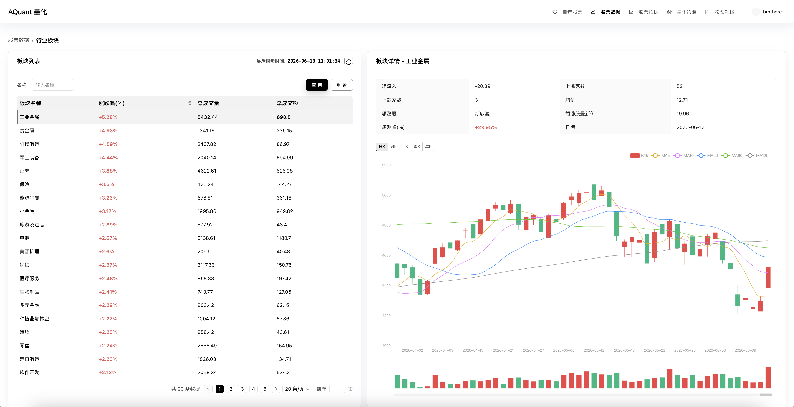
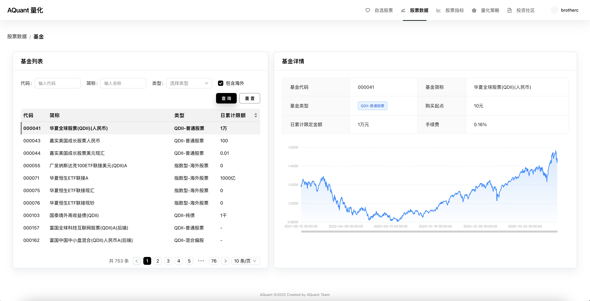

### 股票指标
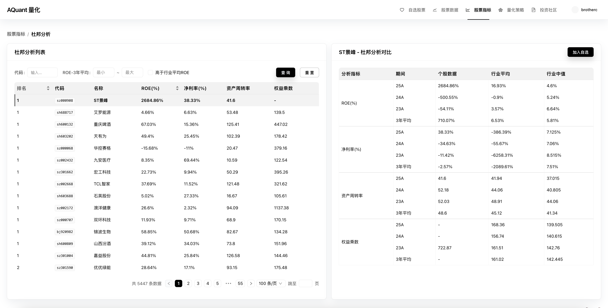  
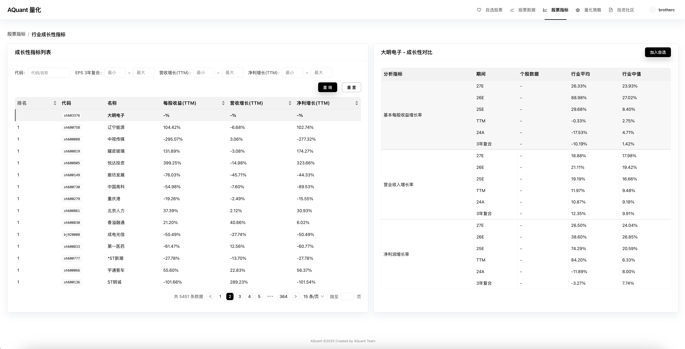  
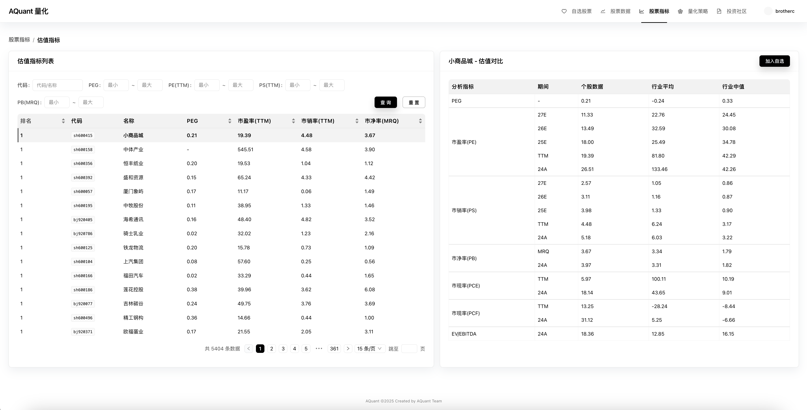  

### 分红数据
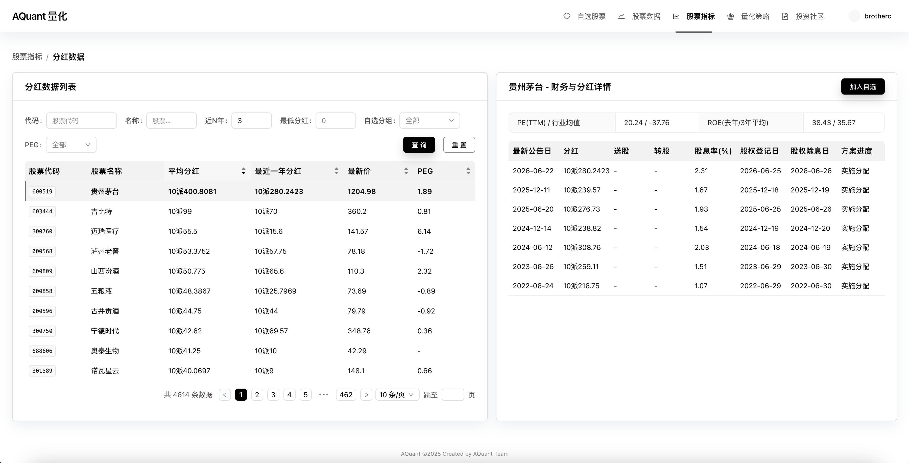

### 策略分析
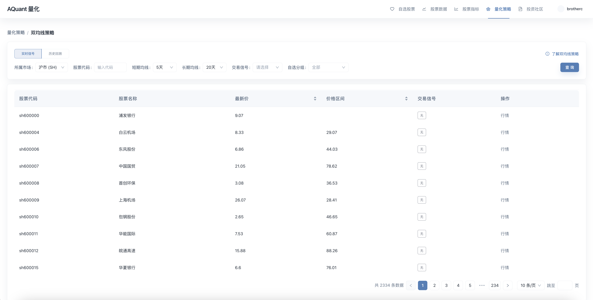
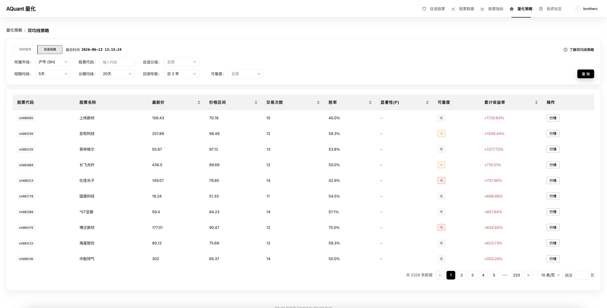
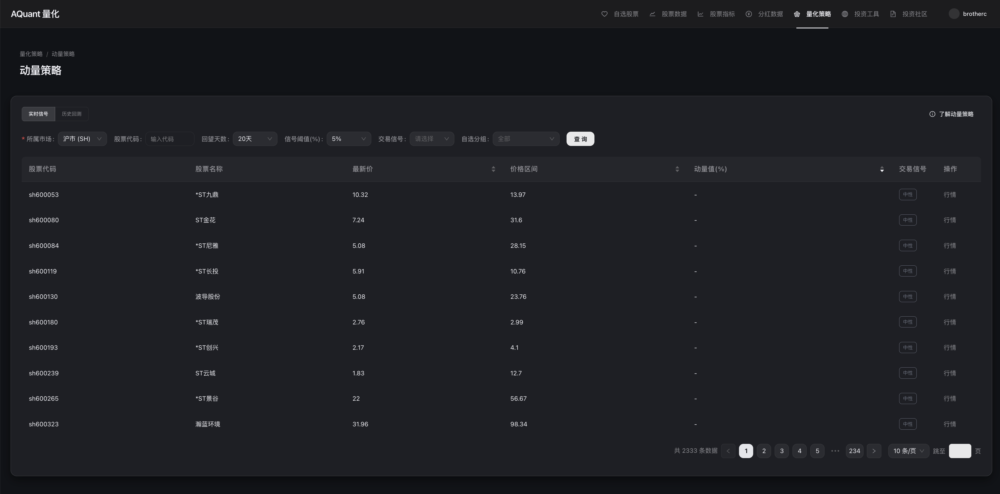  
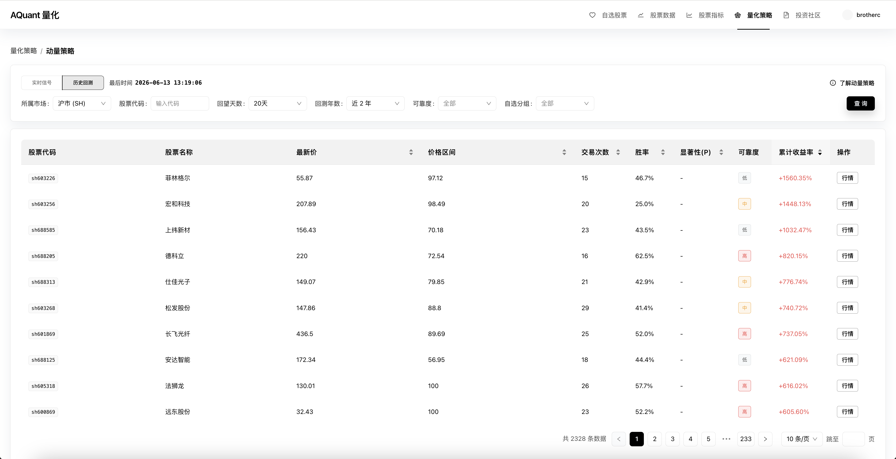

### 常用网站
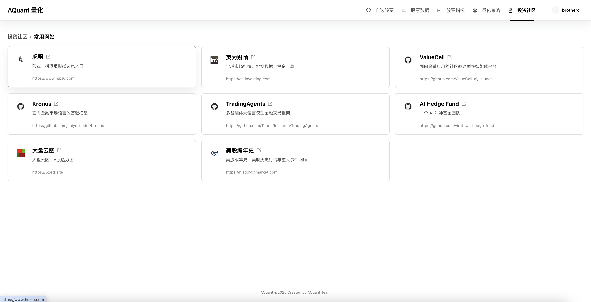

## 🛠️ 技术栈

### 后端 (aquant-backend)
- **核心框架**: Spring Boot 3.x
- **持久层**: Spring Data JPA
- **数据库**: MySQL 8.x
- **连接池**: Druid
- **接口调用**: OkHttp, Gson
- **认证与安全**: JWT, BCrypt
- **缓存**: Caffeine
- **统计计算**: Apache Commons Math
- **邮件服务**: Spring Boot Mail
- **文档工具**: Swagger / SpringDoc OpenAPI 3
- **工具库**: Lombok

### 前端 (aquant-frontend)
- **核心框架**: Vue 3 (Composition API)
- **构建工具**: Vite
- **脚本语言**: TypeScript
- **UI 组件库**: Ant Design Vue 4.x
- **图表库**: ECharts
- **富文本编辑器**: Tiptap
- **状态管理**: Pinia
- **路由管理**: Vue Router
- **网络请求**: Axios

## 📦 快速开始

### 1. 克隆项目
```bash
git clone <repository-url>
cd AQuant
```

### 2. 数据服务器启动 (Python)
由于本项目依赖 AkShare 获取实时金融数据，需先启动 `aktools` 作为本地数据服务端：
- 确保已安装 Python 3.x。
- 执行以下命令：
```bash
pip install aktools
python3 -m aktools
```
- 服务默认运行在: `http://127.0.0.1:8080`

### 3. 后端启动 (Java)
- 进入 `aquant-backend` 目录。
- 在 `src/main/resources/application.yaml` 中配置您的 MySQL 连接信息。
- 执行本地构建并运行：
```bash
cd aquant-backend
mvn clean install
mvn spring-boot:run
```
- 后端服务默认运行在: `http://localhost:8084`
- API 文档访问: `http://localhost:8084/doc.html`

### 4. 前端启动
- 进入 `aquant-frontend` 目录。
- 安装依赖并启动开发服务器：
```bash
npm install
npm run dev
```
- 前端项目默认地址: `http://localhost:5173`
- *注：Vite 已配置代理，会自动转发 `/api` 请求至 backend。*

## 📂 项目结构

```text
AQuant/
├── aquant-backend/          # Spring Boot 后端源码
│   ├── src/main/java        # Java 核心逻辑
│   └── src/main/resources   # 配置文件与资源
├── aquant-frontend/         # Vue 3 前端源码
│   ├── src/api              # 接口请求模块
│   ├── src/views            # 业务页面
│   ├── src/layout           # 基础布局
│   └── src/router           # 路由配置
└── README.md                # 项目文档
```

## 🤝 特别鸣谢

感谢以下优秀项目及数据源为本平台提供的灵感与数据支持：
- [AkShare](https://github.com/akfamily/akshare) - 强大的金融数据接口支持

## 📝 许可证

本项目采用 [MIT License](LICENSE) 授权。

---
*量化有风险，投资需谨慎。*
